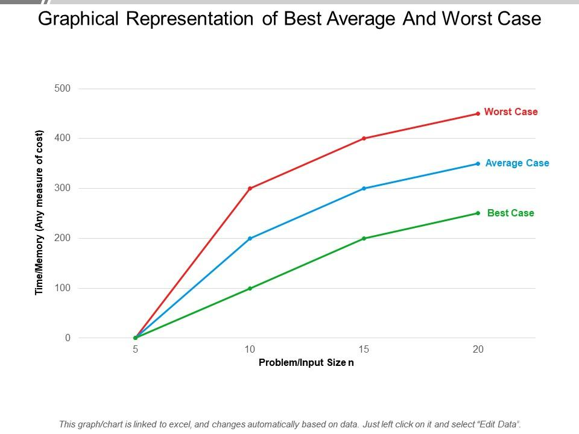

# Time - Space Complexity and Denotations
Time and space complexities can be terms for defining *the cost of running a code*

## Time Complexity
It is the amount of operations an algorithm can perform for the input size $n$.
- **Low complexity**: Fast. Adding two numbers or searching a sorted English dictonary.
- **High Complexity**: Slow. Solving a complex puzzle peice by peice
- **Why it matters**: An algorithm working for 10 items can take 1000 years for working on 10,00,000 items.

## Space Complexity
It measures the extra space or memory an algorithm tkaes to complete it's tasks.
- **Fixed Space $O(1)$**: It means creating a few variables `sum`, `var_1`, `temp` regardless of how big the input is.
- **Linear Space $O(n)$**: Creating an array which grows exactly as large as the input is provided (eg. dynamic array in Java, List in Python)

## Notations

### The big $O$
The big O notation represents the worst case senario of an algorithm. In more general terms (eg): *The situation cannot be worse than this limit*

- **Anology**: Asking a mechanic how much time will it take to repair a car. And he responds: *Atmost 5 hours* meaning not more than 5 hours. It might take 3-4 but definently not 10.
- **Why use it**: In Software, if things get busy (or traffic rises exponentially), we need to know if system crahses or hangs.

### The Big $\Omega$
The Big $\Omega$ represents the best case complexity, i.e., the absolute minimum amount of work required. *(It means the task won't be easier than this)*

- Anology: The mechanic says: *I'll need atleast 30 min just to open the hood and check the engine*, even if the fix is a loose wire you're still paying for the half hour.

- Why use it: Rarely used in real word programming, but helpful in proving that a certain problem cannot be solved faster than a specific speed *(This is the best we have got)*

### The big $\theta$
This notation is used when the best case and worst case are exactly the same. It describes the typical behaviour of the algorithm.

- Anology: It takes 5 min for a few potatos to boil (a few sec up or down). It's not going to take 1 min (best) nor it's going to take 20 min (worst). It's a *tight* prediction.

- Why use it: When we see $\theta$, we can say that the algorithm's performance is very stable and predictable under normal circumstances.

### Comparision Table & Chart

| Notation | Mathematical Goal | Real-World "Vibe"
| -------- | ----------------- | --------------- |
|$O$ (Big-O)| Upper Bound | "The maximum limit" |
| $\Omega$ | Lower Bound | "The minimum Effort" |
| $\Theta$ | Tight Bound | "The Realistic Average" |

# The Big O Fundamentals (O)
In order to understand the code, visualizing the facts is better:
- Visit [bigocheatsheet](https://www.bigocheatsheet.com/) for more details.

- The above image represents the eomplexities as follows:
`O(n!) < O(2^n) < O(n^2) < O(n log n) < O(n) < O(log n) < O(1)`

- From the Common Data Structures Table, understanding the patterns is important right now (not memorising the whole table)

- Key Focus: $O(n^2)$

## Python Internals

### 1. Python List Internals
In Python a list is implemented as a **Dynamic Array**. This means the elements are stored as **contiguous memory** (side by side).

- Why is `list.pop(0)` is slow $O(n)$?

    When we remove the first element from a list, we create an empty space in the memory and since the list is a contiguous data structure, Python has to shift every other element one step to the left.

- Why is `append()` fast $O(1)$?
    
    Python uses **Over-allocation**. When a list is created, Python allocates more space than it needs, so when we add an item, it drops it to the empty space just after a filled item.

    - *[**Note**: Occasionally, the list gets full, and Python has to "resize" it (move everything to a bigger house). This is rare, so we call the cost Amortized $O(1)$.]*

### 2. The deque (The doubly Linked List)
The `collections.deque` is structured differently. It is a linked list in python that stores that in the form of nodes that *points* to previous and next nodes.

- Why is `deque.popleft()` fast ($O(1)$)?

    Unlike **lists** Python doesn't require the elements to shift to the left when the first item is deleted in the *deque*, instead, it makes the 2nd element the `head` of the entire linked list.

    - *[**Note**: "Whether you have 10 items or 10 million, this operation always takes the same amount of time."]*

### 3. Some other Topics:

- A. **Dictionary & Set Lookup ($O(1)$)**

    Dictionaries and Sets use Hash Tables. Instead of searching through the list, Python runs the key through a "Hash Function" that tells it exactly which "bucket" the data is in.
    
    - *[**Interview Tip**: Searching a List is $O(n)$, but searching a Set is $O(1)$. Always use a Set if you need to check "Does this exist?" frequently.]*

- B. **List Slicing ($O(k)$)**

    Doing *my_list[10:50]* isn't free. Python has to create a new list and copy those elements into it. The complexity is $O(k)$, where $k$ is the number of elements in the slice.

- C. **`len()` is $O(1)$**

    You might think Python counts the items every time you call `len()`. It doesn't! The list object has a hidden variable that tracks its own size. Calling `len(my_list)` is an instant lookup $O(1)$.

### 4. Benchmarking with `timeit()`
The timeit() module is the industry standard for measuring small bits of Python code as it *disables* **garbage collection** during the test to give us the purest results.

    import timeit

    # Testing membership in a List vs a Set
    setup_code = """
    import random
    data_list = list(range(10000))
    data_set = set(range(10000))
    target = 9999
    """

    list_test = "target in data_list"
    set_test = "target in data_set"

    # Run the test 10,000 times
    t_list = timeit.timeit(stmt=list_test, setup=setup_code, number=10000)
    t_set = timeit.timeit(stmt=set_test, setup=setup_code, number=10000)

    print(f"List search time: {t_list:.5f}s")
    print(f"Set search time:  {t_set:.5f}s")

| Data Structure | Operation | Complexity | Why? |
| -------------- | --------- | ---------- | ---- |
| List | pop(0) | O(n) | Shifting elements in contiguous memory.
| Deque | popleft() | O(1) | Just updating a pointer in a linked list.
| Dict/Set | in (Lookup) | O(1) | Hash table allows direct access.
| List | append() | O(1)* | Amortized due to over-allocation.