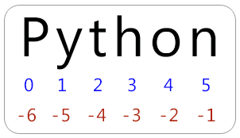

## Strings

Everything enclosed inside the `""` or `''` or `""" """` is termed as strings.
Generally we use `""` for making a strings. Other methods are less common.
Usage (Not some syntax but usage convention):
- `""` is used mostly for writing multiple words in a single line
- `''` is used for writing just a simple word
- `""" """` is used for extending our strings to multiple line (even after we press **Enter**).

### Escape Sequences (`\`)
Some operations cannot be performed directly inside Python. So we make use of **escape sequence**. There are some characters in Python that we cannot use directly inside our strings as it might create conflict with logic.
For eg

In this case we can simple solve the problem by putting the escape sequence `\`. 

There are many other escape sequences in Python that we can use to perform different functionalities in Python:
- `\t`: Used to insert tab space after it's position
- `\n`: This escape sequence adds a new line just after it's current position
- `\'`: Used to add a single quote in the string (can be replaced with **`", ', """`**).

## Concatenation on Strings
Concatenation means adding two or more strings together (joining). Eg:

- `str1 = "hello"`
- `str2 = "world!"`
- `print(str1+str2)`
- OUTPUT: `helloworld!`

This is a valid output in Python

### Obtaining length of a string in Python
**SYTNAX:** `len(<string>)`

### Indexing in Python
In Python, many data structures, after they are created, each item in the data structure is allotted with some index. These indexes help developers to obtain a specific item from the data structure easily.

*[Note: Indexing implies to postioning]*

Eg:~

*[Note: Indexing in Python starts with `0`]*
To access index in Python, for eg, from above image,

If we have to access a character at index (or position) 3, we can use following syntax
    
    str1 = 'Python'
    print(str1[3])

OUTPUT: `h`

*[Note: Since strings are immutable in Python, we cannot change the character at a specific position/index. This will result in TypeError]*

    
    str1 = 'Python'
    str[3] = 'A'

OUTPUT: `TypeError...`

### String Slicing in Python
It is the method in which we break or slice the strings in parts according to our requirements.

Syntax: `slice = str1[<start_index>:<end_index>]`

*[Note: The start_index will be inclusive while the end_index won't, meaning the `end_index - 1` will be taken into consideration]*

Eg

    str1 = 'Python'
    slice = str1[1:5]
    print(slice)

OUTPUT: `ytho`

Thus, Python will count 4 characters in this case `'y', 't', 'h', 'o'`

### String Slicing in Python in Reverse

In the image above, we can see the negative numbers, indicating indexing in reverse, so in the similar way we can do the index slicing in reverse and print the output in reverse

## Important functions in Python
*[Note: All the functions will be ran on the eg below.]*

`str1 = "Hello World!"`

| Function | Description | Example |
| -------- | ----------- | ------- |
| `str.endswith("orld!")` | Checks if a string ends with a specific keyword | `False` |
| `str.capitalize()` | Checks if a string ends with a specific keyword | `HELLO WORLD!`|
| `str.replace(old, new)` | Checks if a string ends with a specific keyword | `str1.replace("World", "Developer") => Hello Developer!` |
| `str.find("char")` | Returns the index of the character if found otherwise -1 | `str1.find("W") => 0`|
| `str.count("str")` | Counts the occurences of a substring | `str1.count('l') => 3` |

---

# Practice Questions
1. WAP to input user's first name & print it's length.
2. WAP to find occurences of '$' in a string.