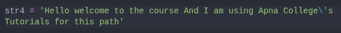

## Strings

Everything enclosed inside the `""` or `''` or `""" """` is termed as strings.
Generally we use `""` for making a strings. Other methods are less common.
Usage (Not some syntax but usage convention):
- `""` is used mostly for writing multiple words in a single line
- `''` is used for writing just a simple word
- `""" """` is used for extending our strings to multiple line (even after we press **Enter**).

### Escape Sequences (`\`)
Some operations cannot be performed directly inside Python. So we make use of **escape sequence**. There are some characters in Python that we cannot use directly inside our strings as it might create conflict with logic.
For eg

In this case we can simple solve the problem by putting the escape sequence `\`. 

There are many other escape sequences in Python that we can use to perform different functionalities in Python:
- `\t`: Used to insert tab space after it's position
- `\n`: This escape sequence adds a new line just after it's current position
- `\'`: Used to add a single quote in the string (can be replaced with **`", ', """`**).
    