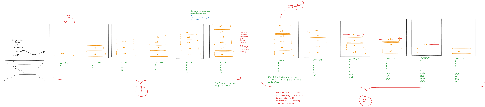

# Functions & Recursion

## Functions in Python
Functions are a block of statements that perform a specific task. They can be configured to take values as parameters or pass arguments (or no arguments at all), and return results (which can then be printed or captured in a variable)

SYNTAX:

    def func_name(parameter1, param2, ..., paramN):
        # some instructions
        return
    
    func_name()

- Functions `parameters` & `return` is optional.
- If we try to store the output of a function with no return statement, it will be stored as `None`.

*[Note: Functions were introduced in order to reduce redudancy in code. A redundant code implies to a bad code]*

## Types of Functions
There are 2 types of functions in Python:
1. **Built-in Functions**: These are the functions that come with the Python library by default. We can import libraries to get more built-in functions for different use cases in Python. Eg, `print()`, `type()`, etc.
2. **User-Defined Functions**: These are the functions made by the user in order to reduce the redudancy & promote reusability in the code

## Default Parameters
When there is no argument passed to a function, we might need to assign some default values to it's parameters (where we defined the function) so that the function not result in error.

*[Note: The default argument should be followed by a non-default argument, the first argument is always the non-default argument, the following arguments are the default ones.]*

## Recursion
When a function calls itself repeatedly.

How to write a recusion function?
- Task. Write down the task which needs to be done first
- Try to implement the logic to recusion
- Write a base condition to prevent the infinite loop in the beginning (according to the case). This condition is called **base case**.

*[Note: By writing the `return`, without any values, in a function, we can simply return to the previous block of code (or simply, return the control to the previous function or code block).]*

**Call Stack:** 
- A call stack is a fundamental concept in Python (and other programming languages) used to manage the execution of active function calls in a program.

        [.............Function...Call.N..........]
        [........................................]
        [........................................] # More such calls
        [.............Function...Call.4..........] ----|
        [.............Function...Call.3..........]     |---> # Sequential Order
        [.............Function...Call.2..........] ----|
        [.............Function...Call.1..........] # Function call 1 executes 1st

- Execution Flow:
    - **Function Call (Push):** When a function is invoked, a "stack frame" (which holds its local variables, parameters, and the return address) is pushed onto the top of the call stack.
    - **Immediate Execution:** The Python interpreter immediately shifts control to execute the code within that new, top-most function. The execution of the previous function is paused.
    - **Nested Calls:** If the current function calls another function, the new function gets its own stack frame pushed onto the top, and it starts executing immediately, pausing the one below it.
    - **Function Return (Pop):** When a function finishes its execution (either by reaching a return statement or the end of its code block), its stack frame is removed (popped) from the stack.
    - **Resuming Execution:** Control then returns to the exact point in the previous (now top-most) function where the call was made, and that function's execution resumes.

    For a diagramatic explaination, refer to [Excelidraw file](./resources/Untitled-2026-03-06-0951.excalidraw)
    For an image based explaination, refer to [PNG File](./resources/Untitled-2026-03-06-0951.png)

    

 
 

- **Recurrence Relation:** A mathematical equation that defines a sequence of terms where each term defined as a function of one or more preceeding terms. Eg, Fibonacci Sequence: Fn = Fn-1 + Fn-2 with F0 = 0 and F1 = 1
- In computer science wherever this recurrence relation comes, recusion also exist there.

*[Note: A stack follows **first in last out** rule, similarly in a call stack, the function call which arrives in stack for the first, executes at last]*

---

## Practice Hub

### Questions on Functions
1. WAF to print the length of a list (list is the parameter).
2. WAF to print the elements of a list in a single line (list is the parameter).
3. WAF to find the factorial of n (n is the parameter).
4. WAF to convert USD to INR.

### Questions on Recusion
1. Write a recursive function to calculate the sum of first n natural numbers.
2. Write a reccursive function to print all elements in a list.
Hint: Use list and index as parameters

---
 

# Personal Notes

## How to Solve the recusion Questions?
### The Recursive Thought Procedure
Follow these four steps to break down any recursive problem:

1. **Define the Goal (What should it do?)**
    - Clearly state what the function is supposed to return for any input.
    - Example: factorial(n) should return the product of all integers from 1 to *n*.
2. **Pick a Subproblem (Assume it works!)**
    - Identify a slightly smaller version of the same problem (e.g., *n-1*). **Crucial Tip:** Take a *"leap of faith"* and assume your function already works perfectly for this smaller case.
    - Example: To find, assume you already have the answer for (n-1)!.
3. **Find the Recursive Relation (Build the bridge)**
    - Determine how to use the subproblem’s solution to solve the original larger problem.
    - Example: If you have the answer for (n-1)!, you just multiply it by *n* to get *n!*.
    - Formula: factorial(n) = n * factorial(n - 1).
4. **Identify the Base Case (When to stop?)**
Find the simplest, most trivial input where the answer is known without any calculation. This prevents infinite loops.
    - Example: For factorials, if *n=0*, the answer is 1. 

###  How to Do It Efficiently
Efficiency in recursion involves both how you write the code and how you think about it:

- **Avoid Tracing Low-Level Calls:** Beginners often try to track every variable in their head, which leads to "endless confusion". Focus only on the single step that links the current problem to the next smallest one.
- **Use Memoization:** For problems with overlapping subproblems (like the Fibonacci sequence), store the results of expensive recursive calls in a table so you don't re-calculate them.
- **Opt for Tail Recursion:** If your language supports it, ensure the recursive call is the very last operation in the function. This allows the compiler to optimize the call stack and prevent stack overflow.
- **Switch to Iteration for Small Data:** In performance-critical systems, use "hybrid algorithms"—start with recursion, but switch to a simple loop once the input size is small enough to reduce function call overhead. 